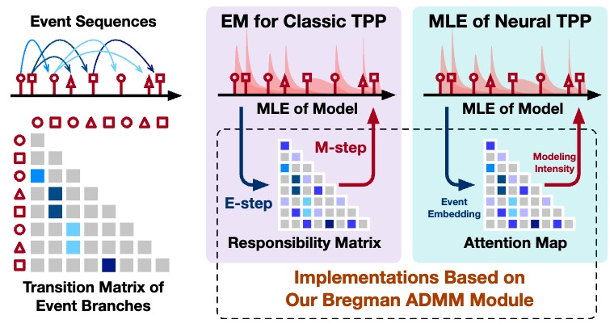
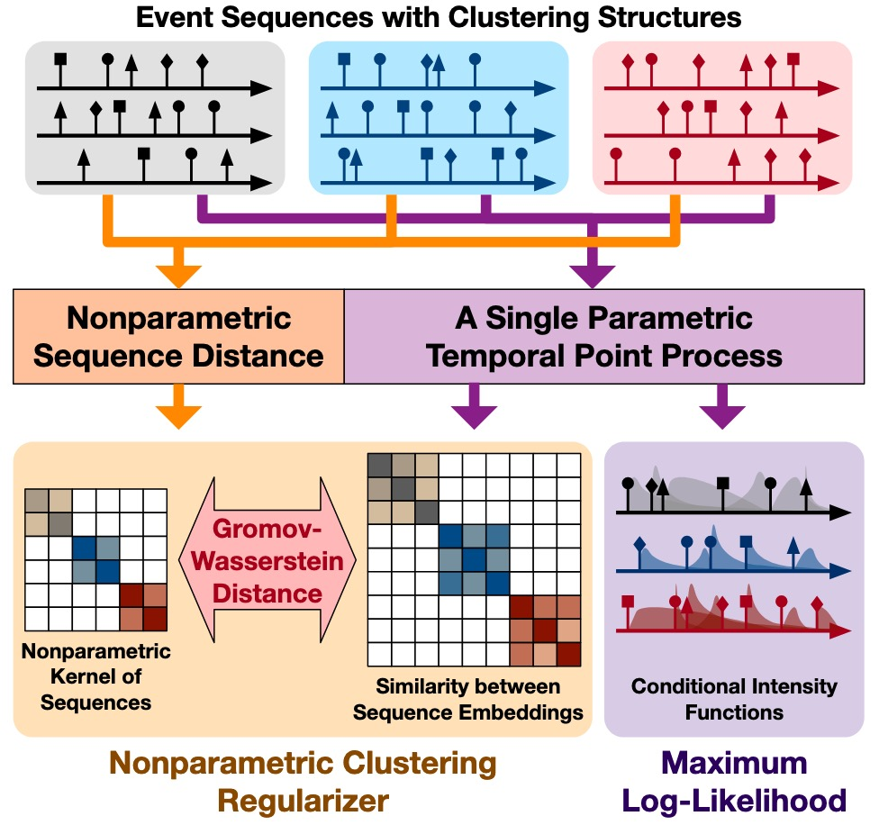
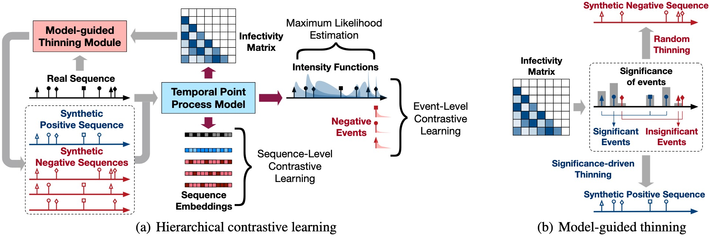








Qingmei Wang (王庆梅 in Chinese) is currently a final-year PhD student at the [Gaoling School of Artificial Intelligence](http://ai.ruc.edu.cn/), [Renmin University of
China](http://www.ruc.edu.cn/), under the supervision of [Prof. Hongteng Xu](https://hongtengxu.github.io/). 

Her research lies in structured data-oriented machine learning and applications. 
In particular, She focuses on temporal point process, optimal transport and deep learning.

Feel free to reach her at <qingmeiwang@ruc.edu.cn> for collaborations or discussions!

# Publications

<dl>
  <dt>
</dt>
  <dd><a href="https://arxiv.org/pdf/2501.04529"><strong>	
A Plug-and-Play Bregman ADMM Module for Inferring Event Branches in Temporal Point Processes
</strong></a></dd>
  <dd><u>Qingmei Wang</u>, Yuxin Wu, Yujie Long, Jing Huang, Fengyuan Ran, Bing Su, Hongteng Xu</dd>
  <dd>The Annual Conference on Artificial Intelligence (<strong>AAAI</strong>), 2025</dd>
</dl>

<dl>
  <dt>
</dt>
  <dd><a href=""><strong>Learning Structure-enhanced Temporal Point Processes with Gromov-Wasserstein Regularization</strong></a></dd>
  <dd><u>Qingmei Wang</u>, Fanmeng Wang, Bing Su, Hongteng Xu</dd>
  <dd>The Web Conference workshop 2025</dd>
</dl>

<dl>
  <dt>
</dt>
  <dd><a href="https://ojs.aaai.org/index.php/AAAI/article/view/26211"><strong>	
Hierarchical Contrastive Learning for Temporal Point Processes
</strong></a></dd>
<dd><u>Qingmei Wang</u>, Minjie Cheng, Shen Yuan, Hongteng Xu</dd>
<dd> <strong><i>Oral Presentation </i></strong> in The Annual Conference on Artificial Intelligence (<strong>AAAI</strong>), 2023</dd>
</dl>

 

 

# Service
  - **Conference Reviewer:** ICML *(2023-2024)*, NeurIPS *(2023-2024)*, ICLR *(2024)*, KDD *(2024)*.

# Teaching
- *2024*, Massive Data Mining (Teaching Assistant)
- *2023*, Introduction to Machine Learning (Teaching Assistant)
